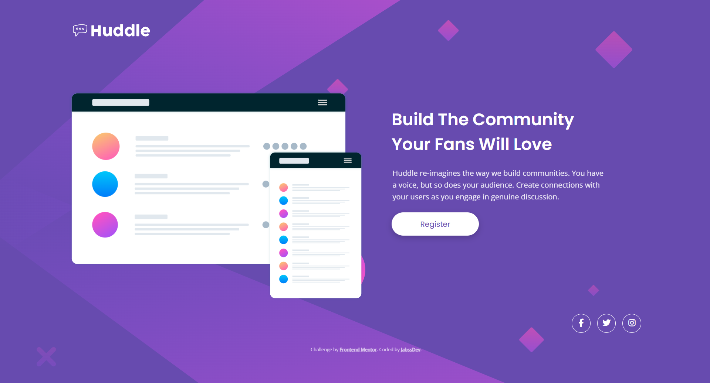

# Frontend Mentor - Huddle landing page with single introductory section solution

Esta es una solución al [Huddle landing page with single introductory section challenge on Frontend Mentor](https://www.frontendmentor.io/challenges/huddle-landing-page-with-a-single-introductory-section-B_2Wvxgi0).

## Contenido

- [Resumen](#resumen)
  - [El desafío](#el-desafío)
  - [Captura de pantalla](#captura-de-pantalla)
  - [Enlaces](#enlaces)
- [Mi proceso](#mi-proceso)
  - [Construido con](#construido-con)
  - [Lo que aprendí](#lo-que-aprendí)
  - [Desarrollo continuo](#desarrollo-continuo)
- [Autor](#autor)

## Resumen

### El desafío

Los usuarios deben ser capaces de:

- Ver el diseño óptimo de la página dependiendo del tamaño de pantalla de su dispositivo.
- Ver estados de hover para todos los elementos interactivos (botón y redes sociales).
- Navegar de forma accesible mediante el teclado.

### Captura de pantalla



### Enlaces

- URL de la solución: [GitHub Repository](https://github.com/jabssdev/huddle-landing-page)
- URL del sitio en vivo: [GitHub Pages](https://jabssdev.github.io/huddle-landing-page/)

## Mi proceso

### Construido con

- Marcado semántico **HTML5**.
- Propiedades personalizadas de **CSS (Variables)**.
- **CSS Grid** para el layout principal.
- **Flexbox** para componentes y footer.
- Metodología **Mobile-first**.
- Iconografía de **Font Awesome 6**.

### Lo que aprendí

Durante este proyecto, me enfoqué en la precisión técnica del diseño y la robustez del código. Un desafío clave fue la alineación vertical y el posicionamiento del pie de página para evitar que se superpusiera al hacer zoom:

```css
/* Ejemplo de alineación óptica ajustada para el Hero */
@media (min-width: 1024px) {
	.hero {
		align-items: start;
		padding-top: 2.5rem;
	}
}
```

### Desarrollo continuo

En futuros proyectos, planeo seguir profundizando en:

- Animaciones complejas con CSS.
- Optimización avanzada de rendimiento de imágenes SVG.
- Pruebas de accesibilidad más rigurosas.

## Autor

- Frontend Mentor - [@jabssdev](https://www.frontendmentor.io/profile/jabssdev)
- GitHub - [JabssDev](https://github.com/jabssdev)
